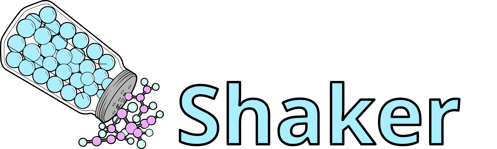

 
`Licenced with LGPLv2.1 <https://www.gnu.org/licenses/old-licenses/lgpl-2.1.en.html>`_

**SHAKER** is a Python toolkit for parameterizing molecules with the Martini coarse-grained (CG) force field
 and validating them against atomistic or quantum-mechanical reference data.

It provides modular utilities for mapping atomistic trajectories to CG representations,
measuring and fitting bonded distributions, preparing GROMACS simulation systems, and
visualizing CG models — all designed for interactive use in Jupyter notebooks.

.. toctree::
   :maxdepth: 1
   :hidden:

   _userguide/userguide.rst
   _modules/modules.rst

.. grid:: 1 1 1 2
   :gutter: 2

   .. grid-item-card:: 
      :text-align: center
      :shadow: sm

      **Tutorials**

      ^^^^^^^^^^^^^^

      The tutorial page provides step-by-step Jupyter notebooks demonstrating the main features and workflows of SHAKER.

      ++++++++++

      .. button-ref:: _userguide/userguide
         :color: primary
         :expand:

         To the Tutorials

   .. grid-item-card::
      :text-align: center
      :shadow: sm

      **Module Reference**

      ^^^^^^^^^^^^^^^^^

      The reference guide contains a detailed description of the modules and its functions.

      ++++++++++

      .. button-ref:: _modules/modules
         :color: primary
         :expand:

         To the Module Reference

Features
--------

- **CG Mapping** — Map AA/QM trajectories to CG beads with flexible bead definitions; generates mapping quality reports with Martini 3 tolerance checks
- **Bonded Analysis** — Measure and compare distance, angle, and dihedral distributions between reference and CG simulations
- **Parameter Estimation** — Estimate initial GROMACS bonded parameters (bonds, angles, proper/improper dihedrals)
- **Dihedral Fitting** — Advanced dihedral fitting with Savitzky-Golay smoothing and multi-term cosine series
- **SASA** — Compute solvent-accessible surface areas with CG-specific van der Waals radii
- **Virtual Sites** — Generate topolgies that use type-3 virtual site definitions
- **Model Quality Assessment** — Evaluate CG model accuracy via pairwise intra-bead distance overlap matrices and ensemble visualization
- **System Setup** — Build solvated Martini simulation boxes and run GROMACS minimization/production MD with minimal boilerplate
- **Visualization** — Render 3D mapping overlays, Connolly surfaces, molecular ensembles, and 2D chemical structures

Installation
------------

### Step1:

Clone the repository

.. code-block:: bash

   git clone https://github.com/Martini-Force-Field-Initiative/shaker/

### Step2:

Install SHAKER and its dependencies with `uv <https://docs.astral.sh/uv/>`_:

.. code-block:: bash

   cd shaker
   uv sync --group test

### Step3:

Test the package with pytest

.. code-block:: bash

   uv run pytest -v tests/

Requirements
------------

- Python >= 3.10
- `MDAnalysis <https://www.mdanalysis.org/>`_
- `NumPy <https://numpy.org/>`_
- `SciPy <https://scipy.org/>`_
- `Matplotlib <https://matplotlib.org/>`_
- `RDKit <https://www.rdkit.org/>`_
- `nglview <https://nglviewer.org/nglview/latest/>`_ (for 3D visualization in notebooks)
- `tqdm <https://tqdm.github.io/>`_
- `GROMACS <https://www.gromacs.org/>`_ (external; required for system setup and SASA)

Typical Workflow
----------------

SHAKER is designed for iterative CG parameterization. A typical session in a Jupyter notebook follows these steps:

**1. Map an atomistic trajectory to CG**

.. code-block:: python

   import shaker

   mapping = {
       "MOL": {
           "B1": {"type": "SC3", "charge": 0, "atoms": ["C1", "C2", "C3"]},
           "B2": {"type": "SC3", "charge": 0, "atoms": ["C4", "C5", "C6"]},
           "B3": {"type": "TC4", "charge": 0, "atoms": ["C7", "C8"]},
       }
   }

   shaker.map_aa2cg("reference.gro", "reference.xtc", mapping, outname="cg_mapped")

This writes `cg_mapped.gro` and `cg_mapped.xtc`, and prints a mapping quality report
comparing your bead count against the Martini 3 ±1/10 heavy-atom tolerance.

**2. Estimate bonded parameters**

.. code-block:: python

   import MDAnalysis as mda

   u = mda.Universe("cg_mapped.gro", "cg_mapped.xtc")

   topology_text = shaker.bonded_estimator(
       u, resname="MOL",
       dist_tgts=[("B1", "B2"), ("B2", "B3")],
       ang_tgts=[("B1", "B2", "B3")],
   )

   print(topology_text)

`bonded_estimator` measures distributions, applies the equipartition theorem for bonds and angles, fits dihedrals via inverted Boltzmann, and returns
GROMACS-formatted topology lines ready to paste into an `.itp` file.

**3. Write an initial topology file**

.. code-block:: python

   shaker.write_initial_CGitp("cg_mapped.gro", mapping, outname="initial_CG.itp")

**4. Set up and run a simulation**

.. code-block:: python

   shaker.prepare_setup_water(
       "cg_mapped.gro",
       structure_itp="initial_CG.itp",
       n_mols=1,
       box_size=5,
       NaCL_Conc=0.15,
   )

   shaker.runSim()

**5. Compare distributions**

.. code-block:: python

   u_aa = mda.Universe("cg_mapped.gro", "cg_mapped.xtc")  # reference
   u_cg = mda.Universe("sim.gro", "sim.xtc")              # CG simulation

   aa_bonded = shaker.measure_bonded_terms(
       u_aa, resname="MOL",
       dist_tgts=[("B1", "B2"), ("B2", "B3")],
       ang_tgts=[("B1", "B2", "B3")],
   )

   cg_bonded = shaker.measure_bonded_terms(
       u_cg, resname="MOL",
       dist_tgts=[("B1", "B2"), ("B2", "B3")],
       ang_tgts=[("B1", "B2", "B3")],
   )

   fig = shaker.plot_bonded_distributions(
       aa_bonded, cg_bonded,
       labels=["AA reference", "CG"],
       colors=["tab:blue", "tab:red"],
   )

**6. Assess model quality**

Visualize the CG ensemble and quantify how well the CG model reproduces the
reference structural distributions with the overlap matrix.

.. code-block:: python

   # Overlay of aligned CG frames — good for spotting sampling issues
   view = shaker.render_ensemble("sim.gro", "sim.xtc", n_frames=50)
   view  # displays an interactive nglview widget in the notebook

   # Pairwise overlap matrix between AA and CG intra-bead distance distributions
   fig = shaker.assess_overlap_matrix(u_aa, u_cg, resname="MOL")

The overlap matrix produces an N×N heatmap of overlap coefficients (0–1) for
every bead pair, plus a per-bead mean column on the right. Values close to 1
indicate the CG model faithfully reproduces the reference geometry; low values
flag which beads need further refinement.

